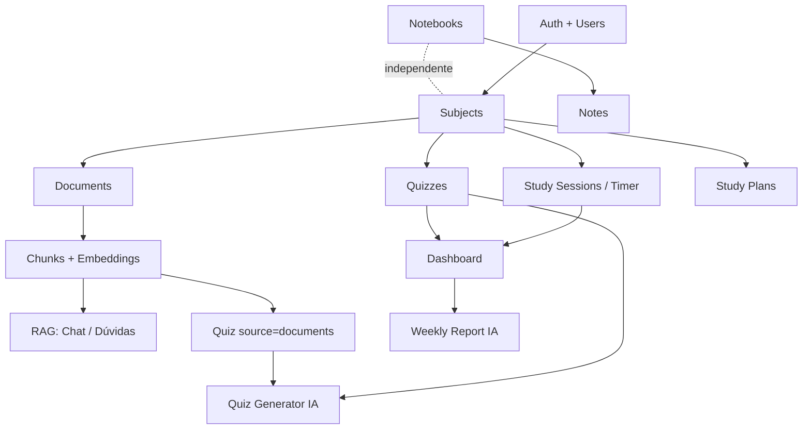

# Tempus — Plano de execução (ultraplan)

## Contexto

O Tempus é uma plataforma web de gestão de rotina de estudos com IA, entregue como projeto da disciplina de Qualidade de Software (4 devs, 3 sprints, avaliação com forte peso em testes e cobertura ≥70%). Hoje é **13/05/2026**: a Sprint 1 venceu ontem (12/05), o repositório só tem `README.md` e `LICENSE`, e o schema (`tempus_schema.sql`) que será aplicado existe fora do repo. Sprint 2 vence em **19/05** e a Sprint 3 (final) em **26/05** — 13 dias úteis até a entrega final.

O plano abaixo destrava a execução paralela das 4 frentes (núcleo, RAG, IA não-RAG, frontend) minimizando bloqueios, antecipa mocks/fakes para que frontend e testes não dependam dos serviços reais, e mapeia o trabalho aos perfis declarados: **João Ricardo** (backend core), **Yago** (RAG + frontend + DB), **Cadu** (RAG + DB), **Alberto** (backend/frontend de apoio).

> **Decisões do time (confirmadas em 13/05/2026):**
> - **UC10 ≠ UC14**: UC10 = "Tirar dúvida com IA usando RAG por matéria" (chat dedicado, com retrieval por subject_id); UC14 = "Visualizar progresso de aprendizado em quizzes" no dashboard (campos `quizzes.score` + `progress_report_subjects.avg_quiz_score` já existem no schema e alimentam a visão agregada).
> - **Sprint 1 atrasada → dia 0 da Sprint 2**: o enunciado descreve Sprint 1 como "em andamento" com entrega 12/05, mas só há README no repo. Sprint 1 entra oficialmente como **dia 0 da Sprint 2** (13/05, item 4.1 abaixo); Sprint 2 "de verdade" começa em 14/05.
> - **Chat em tela própria**: o chat de dúvidas (UC10) ganha **tela dedicada** (`/chat`) em vez de drawer embarcado em Documentos. Total: **8 telas principais pós-login** (subjects, timer, documents, quiz, study-plan, notebooks, **chat**, dashboard) + auth (login/cadastro).

---

## Shape do projeto

```mermaid
graph LR
    PDF[Upload PDF] --> Save[Salvar em ./uploads/uid/did.pdf]
    Save --> Row[INSERT documents status=processing]
    Row --> BG[BackgroundTask]
    BG --> Extract[pdfplumber: extrair texto + páginas]
    Extract --> Chunk[Chunker recursivo ~800 tokens, overlap 150]
    Chunk --> Embed[OpenAI text-embedding-3-small batch]
    Embed --> Insert[INSERT document_chunks com VECTOR 1536]
    Insert --> Ready[UPDATE status=ready]
    Insert -. erro .-> Failed[status=failed + error_message]
    Ready --> Search[Query: embedding cosine ORDER BY <=> LIMIT k=5]
    Search --> Context[Top-k chunks como contexto]
    Context --> Chat[Chat completion GPT-4o]
    Context --> Quiz[Quiz generator JSON mode]
```





---

## 1. Caminho crítico e princípio anti-bloqueio

O caminho crítico é **Auth → Subjects → (paralelo: Sessions | Documents+RAG | Quizzes+IA | StudyPlans)**. Tudo que envolve IA pode ser desenvolvido contra um **fake client** desde o dia 1 (ver §6). Tudo que envolve banco pode ser desenvolvido contra os **modelos SQLAlchemy + Alembic** assim que o schema for portado, sem esperar a infra de produção.

Regras para evitar deadlocks de equipe:
* **Contrato OpenAPI primeiro**: cada endpoint vira um esqueleto `router` retornando `501` + Pydantic schema definitivo nas primeiras 24h. O frontend consome `openapi.json` e gera tipos com `openapi-typescript`.
* **MSW (Mock Service Worker) no frontend**: telas avançam contra mocks até o backend correspondente entrar.
* **pytest com SQLite-em-memória + fixtures**: testes unitários não dependem do Postgres local de ninguém. Apenas integração e E2E sobem container.

---

## 2. Estrutura inicial (executar HOJE — dia 0 da Sprint 2)

### 2.1 Repositório
Criar nesta ordem:

```
backend/
  app/
    __init__.py
    main.py                  # FastAPI app + routers register
    core/
      config.py              # pydantic-settings (DATABASE_URL, OPENAI_API_KEY, SECRET_KEY, JWT_EXPIRES_MIN)
      database.py            # engine, SessionLocal, Base, get_db
      security.py            # hash_password, verify_password, create_access_token
      deps.py                # get_current_user (JWT bearer)
    models/                  # 1 arquivo por agregado: user.py, subject.py, session.py, document.py, quiz.py, study_plan.py, notebook.py, progress.py
    schemas/                 # Pydantic in/out, mesma divisão
    routers/                 # auth, subjects, sessions, documents, tags, quizzes, study_plans, notebooks, notes, dashboard, chat
    services/                # auth_service, session_service, rag_service, quiz_generator, study_plan_generator, progress_service, chat_service, embedding_service, pdf_processor
    integrations/
      openai_client.py       # única interface: get_openai() — fake injetável
  tests/
    unit/
    integration/
    conftest.py              # fixtures: db, client, fake_openai, auth_headers
  alembic/                   # init com env.py apontando para Base.metadata
  uploads/                   # gitignored
  docker-compose.yml         # postgres17 + pgvector (ankane/pgvector)
  requirements.txt
  pyproject.toml             # ruff + pytest config
  .env.example

frontend/
  src/
    features/
      auth/ subjects/ timer/ documents/ quiz/ study-plan/ notebooks/ chat/ dashboard/
    components/              # Button, Input, Modal, Toast, ProgressBar, Spinner
    lib/
      api/                   # client gerado por openapi-typescript
      auth/                  # token storage + interceptor
      mocks/                 # MSW handlers para cada feature
    routes.tsx               # React Router v6
  tests/
    unit/ e2e/
  vite.config.ts             # proxy /api → :8000
  playwright.config.ts

tempus_schema.sql            # commitar a partir do upload (referência)
docs/
  use-cases/                 # UC01.md ... UC15.md (template fixo)
  test-cases/                # mesmo template
  coverage/                  # relatórios HTML por sprint
```

### 2.2 Migrations Alembic vs `tempus_schema.sql`
Não rodar o `.sql` direto em prod/dev. Em vez disso:
1. Definir todos os modelos SQLAlchemy espelhando o schema (enums via `sqlalchemy.Enum(name=...)`, vetor via `pgvector.sqlalchemy.Vector(1536)`).
2. Gerar `alembic revision --autogenerate -m "initial schema"`.
3. **Diff manual** contra `tempus_schema.sql` — qualquer divergência (CHECKs, índices ivfflat, constraints com nome) é corrigida no `op.execute(...)` da migration.
4. O `tempus_schema.sql` fica versionado como **referência canônica** e é a fonte para a documentação do banco.

---

## 3. Backend — endpoints por módulo

Convenção: todos exigem JWT exceto `auth/*`. Erro padrão: `{"detail": "..."}`. Paginação: `?limit=&offset=` retornando `{items, total}`.

### Auth (João Ricardo — Sprint 2, dia 1)
* `POST /auth/register` `{name, email, password}` → `{user, access_token}`
* `POST /auth/login` `{email, password}` → `{user, access_token}`
* `GET /auth/me` → `User`

### Subjects (João Ricardo — Sprint 2, dia 1-2)
* `GET /subjects` → `[Subject]`
* `POST /subjects` `{name, color?, description?, weekly_goal_minutes?}` → `Subject` (erro 409 em nome duplicado por usuário)
* `GET /subjects/{id}` / `PATCH /subjects/{id}` / `DELETE /subjects/{id}`

### Sessions / Timer (João Ricardo — Sprint 2, dia 2-3)
* `POST /sessions` `{subject_id?, planned_duration_seconds}` → cria `in_progress`
* `PATCH /sessions/{id}/pause` / `/resume` / `/complete` / `/abandon` — máquina de estados validada em service
* `GET /sessions?subject_id=&from=&to=` → histórico
* `GET /sessions/{id}`

### Documents (Yago + Cadu — Sprint 2 fim → Sprint 3 início)
* `POST /documents` multipart `{file, subject_id, tag_ids[]?}` → `Document(status=processing)` + agenda `BackgroundTasks`
* `GET /documents?subject_id=&status=&tag_id=` / `GET /documents/{id}` / `GET /documents/{id}/status`
* `DELETE /documents/{id}` (CASCADE em chunks)
* `POST /documents/{id}/summary` → texto narrativo (IA, **independente de RAG estar pronto** — usa texto extraído direto)

### Tags (Cadu — Sprint 3, dia 1)
* `GET /tags` / `POST /tags` `{name, color?}` / `DELETE /tags/{id}`

### Chat / Dúvidas com RAG (Cadu backend + Yago frontend — Sprint 3, dia 2-3) **[depende de RAG ready]**
* `POST /chat/ask` `{subject_id, question, history?}` → faz retrieval nos chunks do `subject_id`, monta prompt, retorna `{answer, sources: [{document_id, page_number, snippet}]}` (endpoint: Cadu em 21/05; tela dedicada `/chat` consumindo o endpoint: Yago em 22/05).

### Quizzes (Alberto + João — Sprint 3, dia 1-3)
* `POST /quizzes/generate` `{subject_id?, source_type, topic_description?, document_ids[]?, total_questions}` → cria quiz + perguntas via `quiz_generator` (JSON mode). **Branch `source_type=documents` depende do RAG**; branch `general_topic` não depende.
* `GET /quizzes` / `GET /quizzes/{id}`
* `POST /quizzes/{id}/start` → muda status para `in_progress`
* `POST /quizzes/{id}/questions/{qid}/answer` `{user_answer: 'a'|'b'|'c'|'d'}` → cria `quiz_answers`, retorna `{is_correct, correct_answer, explanation}`
* `POST /quizzes/{id}/complete` → calcula `score`, status `completed`, `completed_at`

### Study Plans (João Ricardo — Sprint 3, dia 1-2)
* `POST /study-plans/generate` `{title, exam_date?, daily_hours_available, subjects: [{subject_id, priority}]}` → IA gera `plan_content` narrativo, persiste plano + `study_plan_subjects`
* `GET /study-plans` / `GET /study-plans/{id}` / `PATCH /study-plans/{id}` (status active/archived/completed)

### Notebooks + Notes (Alberto — Sprint 3, dia 1-2)
* `GET /notebooks` / `POST /notebooks` / `PATCH /notebooks/{id}` / `DELETE /notebooks/{id}`
* `GET /notebooks/{nbid}/notes` / `POST /notebooks/{nbid}/notes`
* `PATCH /notes/{id}` / `DELETE /notes/{id}`
* `POST /notes/{id}/summary` (IA — análogo ao summary de documento)

### Dashboard + Progress (João Ricardo — Sprint 3, dia 3-4)
* `GET /dashboard/realtime` → cálculo agregado SQL: `hours_today`, `hours_week`, `current_streak`, `weekly_goal_progress[]` por matéria (não persiste).
* `GET /dashboard/weekly-report` → último `progress_reports` do usuário
* `POST /dashboard/weekly-report/generate` → calcula agregados → narrativa IA → persiste `progress_reports` + `progress_report_subjects` (UNIQUE por período já protege duplicidade)

---

## 4. Cronograma por sprint e por pessoa

### 4.1 Sprint 1 (dia 0 — hoje, 13/05) — fechar pendências
Bloco curto, **mesmo dia**, em paralelo:

| Pessoa | Tarefa |
|---|---|
| Yago | Bootstrap frontend (Vite + Tailwind + React Router) + esqueleto das 8 features pós-login + auth (pasta vazia com `index.tsx` placeholder) |
| João | Bootstrap backend (FastAPI + SQLAlchemy + Alembic) + `auth_service` esqueleto + migration inicial |
| Cadu | Portar `tempus_schema.sql` → modelos SQLAlchemy + diff com Alembic + `docker-compose.yml` Postgres+pgvector |
| Alberto | 15 UCs em `docs/use-cases/` (template completo, sem necessidade de código) + casos de uso UC10/UC14 diferenciados |

Entregável Sprint 1 fechado: esqueleto compila, `alembic upgrade head` cria todas as 17 tabelas, README atualizado, UCs documentados, GitHub com branch protection.

### 4.2 Sprint 2 (14/05 – 19/05) — 2 telas CRUD + 1 caso de IA + testes estruturados

**Meta**: Login/Cadastro + Subjects CRUD + Timer funcional + geração de quiz `general_topic` integrada (caso de IA).

| Dia | João Ricardo (Backend core) | Yago (Frontend + DB) | Cadu (RAG + DB) | Alberto (Backend/Frontend apoio) |
|---|---|---|---|---|
| **14/05** | Auth: register/login/me + JWT + tests unit | Tela Login + Cadastro (MSW) | Modelos `documents`, `document_chunks`, `tags` + migration vetor + smoke test pgvector | `quiz_generator` esqueleto + fake OpenAI client + tests unit |
| **15/05** | Subjects CRUD + tests integração | Tela Subjects (lista + CRUD modal) ligando no backend real | `pdf_processor` (pdfplumber → chunks) + tests unit | Quiz `POST /generate` (somente `general_topic`) + tests |
| **16/05** | Sessions: criar/pausar/resumir/completar + máquina de estados + tests | Tela Timer (Pomodoro + livre + seleção de matéria) MSW→real | `embedding_service` (batch, retry, mock) + tests unit | Telas Quiz: gerar + responder (MSW) |
| **17/05** | Sessions: histórico + endpoints faltantes | Integrar Timer com backend real + cronômetro client-side | Endpoint `POST /documents` upload + BackgroundTask wire-up | Tela Quizzes integrada com `/quizzes/generate general_topic` |
| **18/05** | Folga para reviews + bugfix + cobertura | E2E Playwright: fluxo login→criar matéria→timer→encerrar | Endpoint `GET /documents/{id}/status` + polling | Tests integração quizzes + cobertura |
| **19/05** | Deploy local + demo + tag `v0.2.0` | Idem | Idem | Idem |

**Entrega Sprint 2**: ≥2 telas CRUD (Login+Cadastro contam como 1 fluxo; Subjects + Timer fechando o mínimo), backend operante, persistência, OpenAI integrada em `quizzes general_topic`, testes unitários e parte dos de integração, cobertura inicial >50%.

### 4.3 Sprint 3 (20/05 – 26/05) — sistema completo

| Dia | João Ricardo | Yago | Cadu | Alberto |
|---|---|---|---|---|
| **20/05** | Study Plans: endpoint + service IA | Tela Documentos: upload + listagem + status polling | RAG retrieval: `rag_service.search(subject_id, query, k=5)` + tests | Notebooks/Notes backend + tests |
| **21/05** | Dashboard `realtime` (SQL agregado) + tests | Tela Plano de Estudos | Chat endpoint `/chat/ask` integrado com retrieval | Tela Notebooks + Notes (lista + editor markdown) |
| **22/05** | Weekly report generate + tests | Tela Chat dedicada `/chat` (UC10): seletor de matéria, histórico de mensagens, render de citações `[doc, página]` | Quiz `source_type=documents` plugando retrieval no `quiz_generator` | Frontend integração Notebooks com backend |
| **23/05** | Tags CRUD + summary endpoints (documents/notes) | Tela Dashboard (cards realtime + relatório semanal) | Tests integração RAG (fixtures de chunks pré-embedados deterministicamente) | Cobertura quizzes + E2E quiz fluxo |
| **24/05** | Push para 80% cobertura backend + ajustes | E2E completo: upload→quiz documentos→responder→dashboard | Idem | Idem |
| **25/05** | Análise estática SonarQube + correções code smells | Refinos visuais Tailwind + responsivo | Otimização ivfflat (re-criar índice após ingest) | Roteiro de demo + screenshots |
| **26/05** | **Entrega final** — relatório de cobertura HTML, prints, demo ao vivo, tag `v1.0.0` |

---

## 5. Frontend — ordem das telas e contrato

Ordem: **Login → Cadastro → Subjects (CRUD) → Timer → Documentos → Quizzes → Plano de Estudos → Notebooks → Chat (UC10) → Dashboard (UC14)**.

* Geração de tipos: `openapi-typescript http://localhost:8000/openapi.json -o src/lib/api/types.ts` (script `npm run gen:api`, rodar no CI).
* Client HTTP: `fetch` wrapper em `src/lib/api/client.ts` injetando `Authorization: Bearer`.
* Auth storage: token em `localStorage` + context React; rota protegida via `<RequireAuth />`.
* Cada feature tem `pages/`, `components/`, `hooks/`, `api.ts` (chama client tipado), `mocks.ts` (handlers MSW).

---

## 6. RAG — pipeline detalhado

**Bibliotecas (lock no `requirements.txt`):**
* `pdfplumber` para extração (melhor que PyPDF para layout; suficiente para o escopo).
* **Chunker próprio** (não usar LangChain): função `split_text(text, max_tokens=800, overlap=150)` em `services/text_splitter.py` com contagem via `tiktoken` (encoding `cl100k_base`). Reaproveitar `tiktoken` para checar tokens antes do embed.
* `openai>=1.0.0` cliente oficial.
* `pgvector` (extensão Postgres) + `pgvector` (package Python) para tipo SQLAlchemy.

**Fluxo de upload** (`POST /documents`):
1. Valida tamanho ≤500MB, `mime_type=application/pdf`, `subject_id` pertence ao usuário.
2. Persiste arquivo em `uploads/{user_id}/{document_id}.pdf` (UUID gerado antes do INSERT).
3. INSERT em `documents` com `status='processing'`, `total_pages=NULL`, `total_chunks=0`.
4. Agenda `BackgroundTasks.add_task(process_document, document_id)`.
5. Retorna 202 com o document.

**Background `process_document(document_id)`:**
1. `pdfplumber.open(file_path)` → para cada página, extrair texto + número.
2. Concatenar texto, passar por `split_text`.
3. Chamar `embedding_service.embed_batch(chunks)` (batch de até 100, retry com tenacity, fallback `status='failed'`).
4. Bulk INSERT em `document_chunks` com `chunk_index`, `content`, `embedding`, `page_number`, `token_count`.
5. UPDATE `documents` com `total_pages`, `total_chunks`, `status='ready'`, `processed_at=NOW()`.
6. Em qualquer exceção: UPDATE `status='failed'`, `error_message`.

**Retrieval** (`rag_service.search`):
```sql
SELECT id, document_id, content, page_number,
       1 - (embedding <=> :query_embedding) AS score
FROM document_chunks
WHERE document_id IN (
  SELECT id FROM documents WHERE user_id = :user_id AND subject_id = :subject_id AND status = 'ready'
)
ORDER BY embedding <=> :query_embedding
LIMIT :k;
```
Filtrar `score >= 0.7` antes de mandar ao prompt. Truncar contexto total a ~6k tokens.

**Quiz com RAG**: o `quiz_generator` recebe `document_ids[]`, busca chunks top-k por tópico/título, monta prompt e chama OpenAI em JSON mode. Persistir `quiz_sources` com os documentos efetivamente usados.

---

## 7. Mock da OpenAI nos testes

Estrutura única em `backend/app/integrations/openai_client.py`:

```python
class OpenAIClient(Protocol):
    def chat(self, messages, response_format=None, model="gpt-4o") -> dict: ...
    def embed(self, texts: list[str]) -> list[list[float]]: ...

def get_openai() -> OpenAIClient: ...  # dependência FastAPI; em prod retorna client real
```

Fixture central em `tests/conftest.py`:

```python
class FakeOpenAI:
    def __init__(self):
        self.chat_responses = []   # queue de respostas scriptadas
        self.embed_responses = []  # idem
        self.calls = []            # gravação para assertions
    def chat(self, messages, response_format=None, model="gpt-4o"):
        self.calls.append(("chat", messages, response_format))
        return self.chat_responses.pop(0)
    def embed(self, texts):
        self.calls.append(("embed", texts))
        # default: vetor determinístico por texto (hash → 1536 floats)
        return self.embed_responses.pop(0) if self.embed_responses else [_hash_vec(t) for t in texts]

@pytest.fixture
def fake_openai(monkeypatch):
    fake = FakeOpenAI()
    app.dependency_overrides[get_openai] = lambda: fake
    yield fake
    app.dependency_overrides.clear()
```

Helpers de payload em `tests/fixtures/openai_payloads.py`: `make_quiz_response(n_questions=5)`, `make_chat_response(text)`, `make_embedding(seed)`. Toda a suíte de testes (unit + integração) usa esse fake; **nenhum** test toca rede.

---

## 8. Riscos e mitigações

| Risco | Impacto | Mitigação |
|---|---|---|
| pgvector não instala localmente | Bloqueia todos | `docker-compose.yml` com imagem `ankane/pgvector:pg17`; README com comando único `docker compose up -d`; CI usa mesma imagem |
| Custo/rate limit OpenAI | Estoura orçamento | Fake nos testes (§6); cap de tokens; cache de embeddings por hash de chunk |
| ivfflat com poucos dados → recall baixo | Quiz/chat ruim | Aceitar nas primeiras semanas; rodar `REINDEX` ou recriar índice depois do primeiro batch real de uploads; `SET ivfflat.probes = 10` na sessão de query |
| Geração IA inconsistente (quiz com 3 alternativas, etc.) | Falha de constraint | JSON mode + Pydantic validation antes de persistir; retry 1x; teste de geração com response_format fixo |
| Background tasks falham em silêncio | Docs ficam `processing` para sempre | `error_message` populado; endpoint `POST /documents/{id}/reprocess` (Sprint 3) |
| Cobertura abaixo de 70% no fim | Penaliza nota | Métrica de cobertura no CI por PR; falhar PR abaixo de 70%; meta interna 80% |
| Conflitos de merge em `models/` e `schemas/` | Atrito 4 PRs/dia | 1 arquivo por agregado; convenção de ownership por feature; commits pequenos |
| Timezone do dashboard | Hora "hoje" errada | Usar `users.timezone`; conversão `AT TIME ZONE` no SQL agregado |
| Upload de 500MB pendura request | Timeouts | `UploadFile.stream` chunked; limite hard no Nginx local (dev usa Vite proxy direto) |
| Demo ao vivo cai por dependência externa | Constrangimento | Modo demo: env var `OPENAI_FAKE=true` ativa client fake também em runtime (apenas para demo de backup) |

---

## 9. Fluxo Git / PR

* **Trunk-based light**: `main` protegida (PR + 1 approval + CI verde).
* **Branches**: `feat/<modulo>-<curto>`, `fix/<...>`, `chore/<...>`. Sem long-lived branches.
* **Commits**: Conventional Commits (`feat:`, `fix:`, `test:`, `chore:`, `docs:`). Habilita changelog automático.
* **PRs pequenos** (<400 linhas diff sempre que possível). Template com: o que muda, como testar, screenshots se UI, checklist de testes adicionados.
* **Ownership de review**:
  - Backend core (auth, subjects, sessions, dashboard, plans): **revisa Alberto**.
  - Frontend: **revisa Alberto** (e Yago auto-revisa quando autor).
  - RAG / banco / migrations: **revisa Yago ou Cadu** (quem não for o autor).
  - Quiz/notebooks: **revisa João**.
* **CI obrigatório** no PR: `pytest --cov` + `vitest` + `ruff` + `tsc --noEmit`. Falha cobertura <70%.
* **Daily async** no Discord/Slack: o que fiz / o que vou fazer / bloqueios. Stand-up presencial 1x/sprint.

---

## 10. Checklist por sprint

### Sprint 1 (fechar hoje 13/05)
* [ ] `tempus_schema.sql` commitado em `/`
* [ ] Esqueleto backend compila, `uvicorn` sobe, `/docs` aberta
* [ ] Esqueleto frontend roda (`npm run dev` exibe rotas vazias)
* [ ] Alembic gerou migration inicial e roda em Postgres+pgvector via docker-compose
* [ ] 15 UCs documentados em `docs/use-cases/`
* [ ] README atualizado com instruções de docker-compose
* [ ] Branch protection ativa, template de PR criado

### Sprint 2 (entrega 19/05)
* [ ] Auth completa (register/login/me) com testes unit + integração
* [ ] Subjects CRUD frontend ↔ backend
* [ ] Timer funcional (criar/pausar/retomar/encerrar) frontend ↔ backend
* [ ] Quizzes `general_topic` end-to-end (1 caso de IA)
* [ ] Testes unitários estruturados (todas as services com cobertura inicial)
* [ ] Parte dos testes de integração (auth, subjects, sessions, quiz general_topic)
* [ ] Cobertura ≥50%
* [ ] Casos de teste documentados em `docs/test-cases/` para UC01, UC02, UC03, UC04, UC07, UC08, UC15
* [ ] Demo Sprint 2 em vídeo de 3min

### Sprint 3 (entrega final 26/05)
* [ ] 8 telas principais pós-login (subjects, timer, documents, quiz, study-plan, notebooks, chat, dashboard) + auth (login/cadastro) funcionais
* [ ] 15 UCs implementados (UC01–UC15)
* [ ] RAG funcionando: upload PDF → chunks → retrieval → quiz/chat
* [ ] Dashboard com métricas realtime + relatório semanal IA
* [ ] Suíte completa: unit + integração + E2E Playwright (≥3 fluxos críticos)
* [ ] Cobertura backend ≥70% (meta 80%) com relatório HTML em `docs/coverage/`
* [ ] Análise estática SonarQube com relatório em `docs/sonar/`
* [ ] Todos os casos de teste em `docs/test-cases/` com status final preenchido
* [ ] README final com prints das 8 telas principais + auth
* [ ] Roteiro de demo ao vivo (10min) + slides de apresentação
* [ ] Tag `v1.0.0` + release notes

---

## Critical files (referência para implementação)

* `tempus_schema.sql` — fonte canônica do schema (verificar diff com Alembic)
* `backend/app/integrations/openai_client.py` — ponto único de injeção da IA
* `backend/app/services/rag_service.py` — retrieval (SQL acima com pgvector)
* `backend/app/services/pdf_processor.py` — pipeline async de chunking
* `backend/app/services/text_splitter.py` — splitter próprio com tiktoken
* `backend/app/services/quiz_generator.py` — JSON mode + Pydantic validation
* `backend/app/services/session_service.py` — máquina de estados de `study_sessions`
* `backend/app/services/progress_service.py` — agregados SQL para dashboard/realtime
* `backend/tests/conftest.py` — `fake_openai`, `db`, `client`, `auth_headers`
* `frontend/src/lib/api/types.ts` — gerado de `openapi.json`
* `frontend/src/lib/mocks/handlers.ts` — MSW handlers por feature

## Verificação end-to-end

1. **Setup**: `docker compose up -d` (Postgres+pgvector) → `alembic upgrade head` → `uvicorn app.main:app --reload` → `npm run dev`.
2. **Fluxo crítico manual**: criar conta → criar matéria "Cálculo I" com meta 600min → iniciar sessão Pomodoro de 25min → completar → upload de PDF → aguardar status `ready` → abrir tela Chat e tirar dúvida com fontes citadas (UC10) → gerar quiz a partir do PDF → responder → ver score + progresso por matéria no dashboard (UC14) → gerar relatório semanal → verificar narrativa IA.
3. **Testes**: `cd backend && pytest --cov=app --cov-report=html --cov-fail-under=70` + `cd frontend && npm run test` + `npx playwright test`.
4. **Análise estática**: `sonar-scanner` com `sonar-project.properties` na raiz.